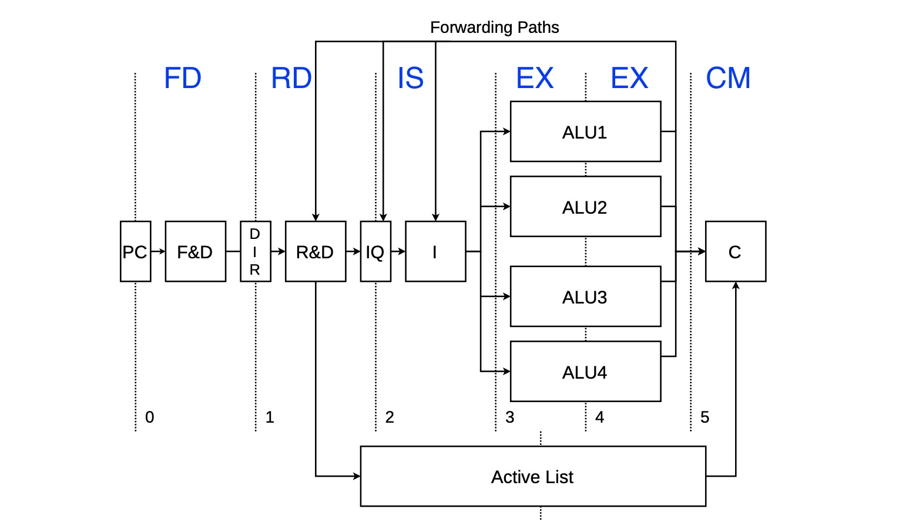

# Structure

```
.
├── README.md
├── logback.xml
├── pom.xml
├── src
│   ├── main
│   │   ├── java
│   │   │   ├── Main.java
│   │   │   ├── mips
│   │   │   │   ├── Control.java    // Main simulation logic
│   │   │   │   ├── Storage.java    // Store state of the processor
│   │   │   │   ├── dataStructure
│   │   │   │   │   ├── ActiveListItem.java
│   │   │   │   │   ├── Instruction.java
│   │   │   │   │   ├── IntegerQueueItem.java
│   │   │   │   │   └── PhyRegFile.java
│   │   │   │   └── state           // functions in each stage
│   │   │   │       ├── FD.java     // 1. Fetch and Decode
│   │   │   │       └── RD.java     // 2. Rename and Dispatch
│   │   │   │       ├── IS.java     // 3. Issue
│   │   │   │       ├── EX.java     // 4. Execute
│   │   │   │       ├── CM.java     // 5. Commit
│   │   │   └── util
│   │   │       └── Parser.java     // input and output JSON
│   │   └── resources
│   └── test
│       └── java
└── target
```

# Implementation Details

## Stages



## I/O

# Run

## 1. run jar in terminal

1. Put test.json in target folder

2. cd to target

3. Run

   ```
   java -jar ACA-hw1-1.0-SNAPSHOT-jar-with-dependencies.jar "test.json"
   ```

4. It will output test_output.json

## 2. run Main in IDEA

1. Put test.json in this folder

2. Open Main.java in IDEA

3. Modify line 15 & 16

   ```java
   // String testFileName = args[0];
   String testFileName = "test.json";
   ```

4. Run Main

5. It will output test_output.json